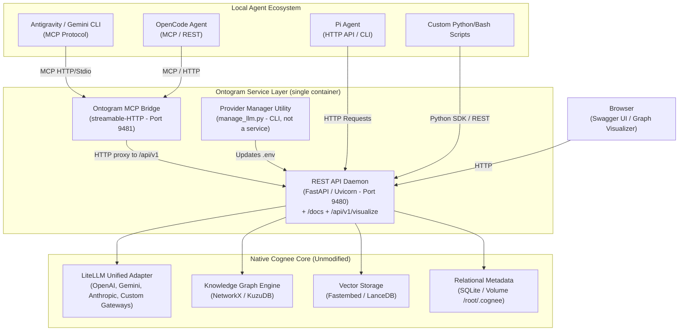

# Ontogram — Architecture & System Design

This document details the architectural layout, data flow, storage engines, and
multi-agent memory partitioning model of **Ontogram**, the hybrid memory service
built on **Cognee core**.

---

## 1. System Overview

### What actually runs

Ontogram is deliberately small: **two processes, two ports, one container.**

| Component | Process? | Port | Notes |
| :--- | :--- | :--- | :--- |
| REST API Daemon | Yes — `uvicorn cognee.api.client:app` | `9480` | Owns every database file. Also serves `/docs` and `/api/v1/visualize`. |
| Ontogram MCP Bridge | Yes — `cognee_mcp_server.py` | `9481` | Stateless proxy to the daemon over HTTP. Holds no DB handles. |
| Graph Visualizer | No | — | An endpoint on the daemon (`/api/v1/visualize`), not a service. |
| `manage_llm.py` | No | — | One-shot CLI that reads/writes `.env`. |

> [!NOTE]
> **There is no web frontend.** An earlier design included a Next.js dashboard on
> its own port; it was removed. `docker-compose.yml` publishes only `9480` and
> `9481`, the image contains no Node/npm build stage, and `start_services.py`
> launches only the two processes above. The sole browser-facing surfaces are the
> Swagger docs and the graph visualizer, both served by the daemon on `9480`.

### Persistence

All state lives on the named volume `cognee_data`, mounted at `/root/.cognee`,
with `DATA_ROOT_DIRECTORY`, `SYSTEM_ROOT_DIRECTORY`, and `CACHE_ROOT_DIRECTORY`
pointed inside it. Those three variables are **required**: Cognee core otherwise
defaults to paths inside its own package directory, which live in the image
layer, so every `--build` would silently discard all memory.

---

## 2. Core Concepts

### A. The ECL (Extract, Cognify, Load) Pipeline
Ontogram delegates ingestion to the Cognee core ECL pipeline, which organizes
raw unstructured information into structured, queryable knowledge graphs:
1. **Extract**: Chunking text into semantically meaningful paragraphs and sentences.
2. **Cognify**: Calling the configured LLM to extract entities, relationships, summaries, and graph node schemas.
3. **Load**: Writing node-edge tuples to graph databases (KuzuDB/NetworkX) and vector embeddings to LanceDB.

### B. Why Hybrid Daemon Architecture?
Default file-backed databases (SQLite, LanceDB) locking occurs when multiple agents attempt concurrent read/write operations on raw filesystem files.
- The **REST API Daemon** provides connection pooling and asynchronous job queues.
- The **Ontogram MCP Bridge** maps tool calls (`remember`, `recall`, `list_agents`) directly to the running REST API.

---

## 3. Multi-Agent Memory Partitioning Strategy

Ontogram uses dynamic Cognee dataset isolation to segregate agent knowledge while allowing shared access when needed. The **scoped-memory contract** (shared with the omp-deck MemoryService) resolves a `(scope, project_id, session_id)` triple into a dataset name:

| Scope | Dataset Name | `X-User-Id` Header | Description |
| :--- | :--- | :--- | :--- |
| `global` | `deck_global_memory` | `global` | Shared knowledge base accessible across all projects and agents. |
| `project` | `deck_<project-slug>_memory` | `<project-slug>` | Per-project memory (decisions, architecture notes, bug logs). |
| `session` | `deck_<project-slug>_<session-slug>_memory` | `<project-slug>` | Per-session scratch memory inside a project. |

Missing ids degrade leniently: a session scope without ids falls back to
project, then global.

> [!NOTE]
> **Legacy partitioning** (`<agent_id>_memory`, e.g. `antigravity_memory`,
> `pi_memory`) is still served — `list_agents` surfaces those datasets and
> `agent_client.py` writes to them. New integrations should use the scope triple.

---

## 4. Async Ingestion Performance

By configuring `run_in_background=True` on memory ingestion (`remember`):
1. The REST API receives the request and returns **`200 OK` / `202 Accepted` in < 1 second**.
2. The server processes entity extraction and Knowledge Graph construction asynchronously in the background.
3. Agents continue execution immediately without waiting for graph building.
